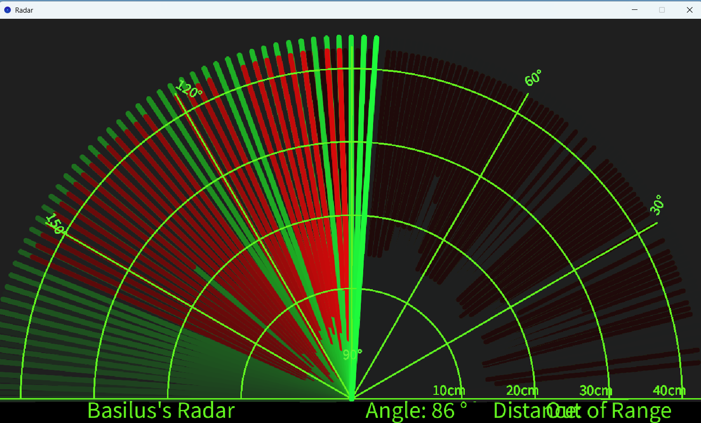
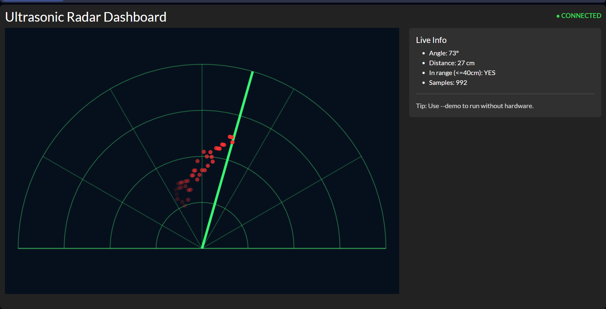
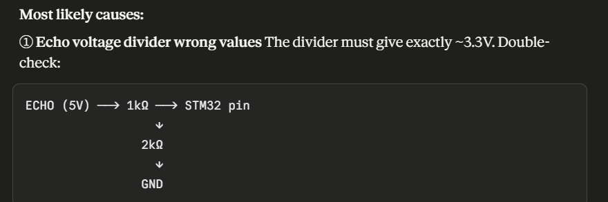
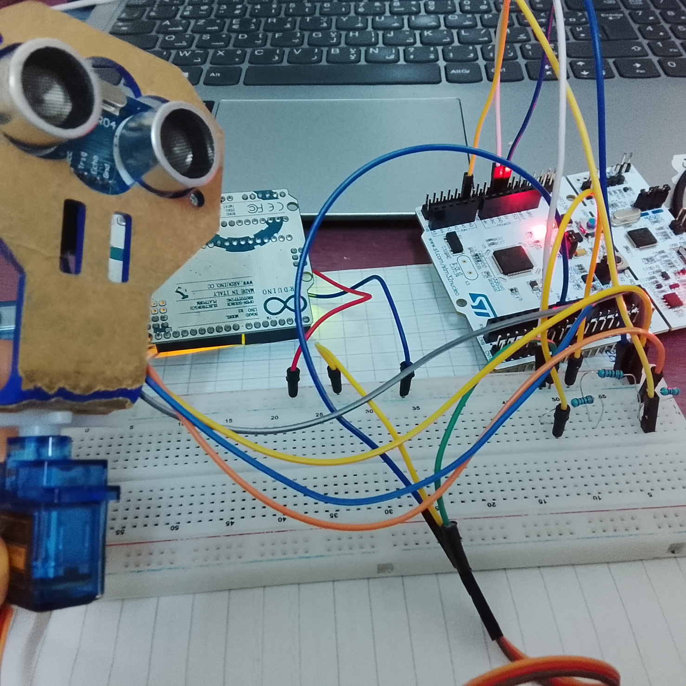

# Radar_Project — Ultrasonic Radar (Arduino / STM32) + Dash Visualization

A complete **ultrasonic radar scanning system** that detects obstacles with an **HC‑SR04 ultrasonic sensor** mounted on a **servo** and visualizes the scan in real time.

This repository includes:
- **Arduino firmware** to sweep the servo and stream `angle,distance` over Serial
- A **Processing** radar visualization (classic “green radar”)
- A **Python Dash** web dashboard (works in **demo mode** or with a real COM port)
- An **STM32CubeIDE / STM32F411** project folder (`finRADAR`) and configuration notes

---

## Project Preview (Screenshots)

### Processing Radar View


### Python Dashboard (Dash)


### Wiring / Sensor Setup


### STM32 Setup


---

## Repository Structure

| Path | Description |
|------|-------------|
| `radarDASH/radarDASH.ino` | Arduino sketch: servo sweep + HC‑SR04 distance + Serial output |
| `radar_dashboard_processing/Radar.pde` | Processing sketch: radar visualization |
| `radar_dash_python/radar_dashboard.py` | Python Dash dashboard: real-time visualization + demo mode |
| `finRADAR/` | STM32CubeIDE project (STM32F411) |
| `STM32CubeIDE Configuration.txt` | STM32CubeIDE notes/configuration |
| `images/` | Screenshots / wiring images |

---

## Hardware Requirements

### Minimum (Arduino version)
- Arduino (UNO/Nano/etc.)
- **HC‑SR04** ultrasonic sensor
- **Servo motor** (e.g., SG90)
- Jumper wires + breadboard
- USB cable

### STM32 option
- STM32 board (project suggests **STM32F411RE** family)
- STM32CubeIDE

---

## Serial Protocol (Arduino → PC)

The Arduino firmware prints one line per measurement:

```text
angle,distance
```

Example:
```text
137,22
```

- **angle** in degrees (servo sweep)
- **distance** in centimeters

This format is compatible with both:
- `Radar.pde` (Processing)
- `radar_dashboard.py` (Python Dash)

---

## 1) Arduino Firmware

**File:** `radarDASH/radarDASH.ino`

### What it does
- Sweeps the servo across an angle range
- Triggers the HC‑SR04
- Computes distance from echo pulse time
- Streams measurements over Serial at 9600 baud

### Upload
1. Open `radarDASH/radarDASH.ino` in Arduino IDE
2. Select your board + COM port
3. Upload

---

## 2) Processing Radar Visualization

**Folder:** `radar_dashboard_processing/`  
**File:** `Radar.pde`

### Run
1. Install Processing
2. Open `Radar.pde`
3. Edit the COM port inside the sketch (example: `COM6`)
4. Run ▶

You should see the green radar sweep and red detection marks.

---

## 3) Python Dash Dashboard (Recommended)

**Folder:** `radar_dash_python/`  
**File:** `radar_dashboard.py`

### Why Dash?
Dash runs in your browser and avoids native Qt DLL issues. It can run:
- **Demo mode** (no Arduino required)
- **Live serial mode** (Arduino connected via COM port)

### Install dependencies
```bash
pip install dash plotly pyserial pandas
```

### Run (Demo mode — no hardware)
```bash
python radar_dash_python/radar_dashboard.py --demo
```

### Run (Live mode — Arduino connected)
```bash
python radar_dash_python/radar_dashboard.py --port COM6 --baud 9600
```

Then open the URL shown in the terminal (usually):
```text
http://127.0.0.1:8050/
```

---

## 4) STM32 (CubeIDE) Project

**Folder:** `finRADAR/`  
Contains the STM32CubeIDE project:
- `.ioc` configuration
- linker scripts (`STM32F411RETX_*.ld`)
- Core / Drivers structure

**Notes:** `STM32CubeIDE Configuration.txt`

### Use
1. Install STM32CubeIDE
2. File → Open Projects from File System…
3. Select `finRADAR/`
4. Build / Flash depending on your board/debugger

---

## Troubleshooting

### Dash dashboard runs but no data appears
- Confirm Arduino Serial Monitor shows lines like `angle,distance`
- Ensure the correct COM port is used (`--port COMx`)
- Make sure baud matches Arduino (`9600`)

### Processing shows nothing
- Update COM port in `Radar.pde`
- Close Arduino Serial Monitor before running Processing (only one program can use the port at a time)

### Distance always “out of range”
- Check wiring: trig/echo pins, 5V, GND
- Ensure sensor faces the target
- Avoid soft surfaces (they absorb ultrasound)

---

## Future Improvements (Ideas)
- Add object tracking (cluster detections over multiple sweeps)
- Add distance filtering (median / moving average)
- Add calibration mode (servo endpoints, sensor offset)
- Export CSV logs from the dashboard

---

## License
Feel free to use it for your studies and (good luck)
